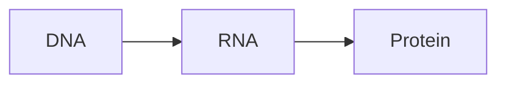
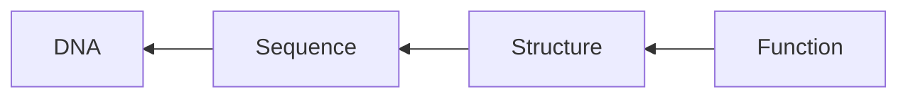
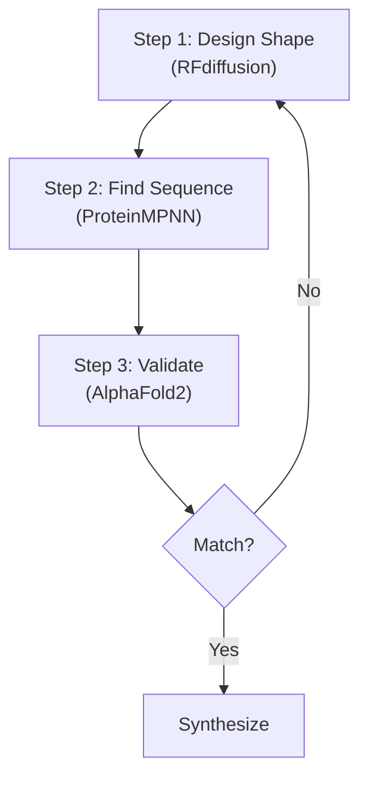
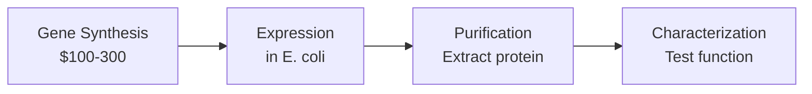
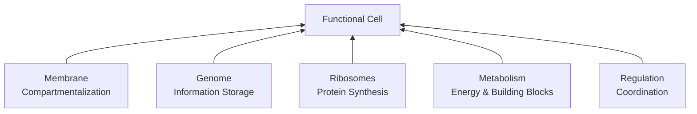

Proteins are the most basic structure of biological mechanisms. Our understanding of how they are made is well established through [the central dogma](https://en.wikipedia.org/wiki/Central_dogma_of_molecular_biology). The "dogma" in question is the idea that we can only go one way on the path from.

This has some wrinkles in that RNA can be used to make DNA and DNA and RNA can both replicate. However, the dogma still stands in that no organism can go from Protein back to DNA. 

## Why do we care about this? 
We want to be able to take advantage of proteins' existing machinery to create micro machines. The design space of proteins is massive, and very under explored - If we can design proteins on demand to do a function that we specify, all we have to do is drop the protein's DNA into a factory organism and we can mass produce it. This can be used for compound synthesis, and a whole wealth of life changing things in medicine. Looking a bit farther ahead, there's the possibility of making artificial life, which is what interests me.

![[kinesin.gif]]
*Kinesin, a protein used to transport various things such as vesicles along a microtubules within a cell.* [Credit: John Liebler](https://www.artofthecell.com/well-you-can-tell-by-the-way-i-use-my-walk/)

As you can see, we've found some remarkable proteins that have been "designed" purely through evolution and natural selection. One can imagine the possibilities if we try to bring in targeted design and optimization to this.

For context on the scale here: there are 20^200 possible sequences for just a 200 amino acid protein - more than the number of atoms in the universe. Evolution has explored only a tiny fraction of this space, and only for solving biological problems, not human-engineered ones.

## How do we break the dogma?
The main problem here is the core problem of protein engineering: given a sequence of polypeptides, how do we predict the 3d structure it will fold up into?

We're essentially trying to reverse engineer nature's process - instead of going from DNA → RNA → Protein, we want to go from **Function** → **Structure** → **Sequence** → **DNA**.

### Modern computational approach
Recent advances in AI have made this tractable. The process now works in three steps:

#### Step 1: Design the Shape
Design the 3D backbone structure. This used to require manually piecing together fragments from known proteins, but tools like RFdiffusion can now generate entirely new protein structures from scratch.

#### Step 2: Find the Sequence
Solve the "inverse folding problem" - given a folded structure, find an amino acid sequence that will fold into it. Tools like ProteinMPNN handle this with high accuracy, significantly outperforming physics-based methods.

#### Step 3: Validate in Silico
Before experimental synthesis, validate the design using AlphaFold2. Feed the designed sequence into AlphaFold and check if it predicts the same structure we designed. Close matches get greenlit for synthesis.

This creates a powerful generate-validate cycle where AI tools work together to rapidly iterate through design space.

## From Computer to Reality
Computational design is only half the problem. You still need to synthesize and test the protein experimentally.

### Synthesis and Testing
The experimental pipeline is well-established:

1. **Gene synthesis**: Companies like IDT synthesize your gene ($100-300)
2. **Expression**: Grow in E. coli as a living factory
3. **Purification**: Extract your protein from bacterial proteins
4. **Characterization**: Verify folding and function

### The Reality Gap
Many proteins that appear optimal computationally fail experimentally. They may be toxic to host cells, form aggregates, or simply not function as intended. This experimental filter highlights the complexity our models still miss - the cell is a noisy, crowded environment with quality control systems and off-target interactions.

Cost per design cycle: ~$3,000-6,000 at universities, up to $10,000+ commercially.

## Building Life from Scratch
Individual protein design enables a bigger question: can we build entire cells?

### The Minimal Cell
The J. Craig Venter Institute created JCVI-syn3.0, the world's smallest living cell with only 473 genes. Remarkably, they don't know what 149 of those genes do - nearly a third of the minimal genome required for life remains functionally unknown.

### Bottom-Up Synthetic Biology
The alternative approach: build a cell from non-living components. This requires integrating:
- Membrane compartmentalization
- Genetic information storage
- Protein synthesis machinery
- Metabolic pathways
- Coordinated regulation

The integration bottleneck is severe - chemical conditions optimal for one subsystem often inhibit others. This remains largely in the research phase.

## Getting Started
Entry points depend on your resources and commitment:

**Citizen Science**: Foldit (protein folding puzzle game), Rosetta@home (distributed computing)

**Competition**: iGEM (International Genetically Engineered Machine competition) - teams build biological systems from standard parts

**Serious Hobbyist**: Download tools like Rosetta, AlphaFold2, or RFdiffusion. Most software is free for academic use. The barrier is experimental validation - requires lab partnerships or outsourcing.

**Professional**: Requires computing clusters, wet lab access, and significant funding.

## Applications and Implications
The potential applications are significant:
- Precision therapeutics
- Environmental remediation (plastic-degrading enzymes)
- Novel materials
- Artificial biological systems

But the technology raises important questions about biosecurity, environmental impact, and the ethics of creating life.

We're moving from reading biology to writing it. The engineering challenges are substantial, but the fundamental capability is now established.